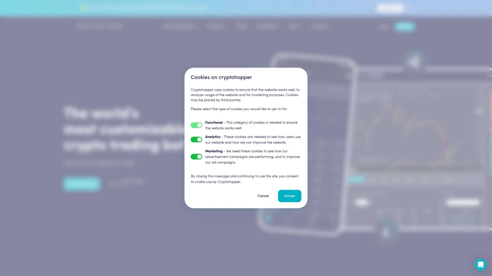
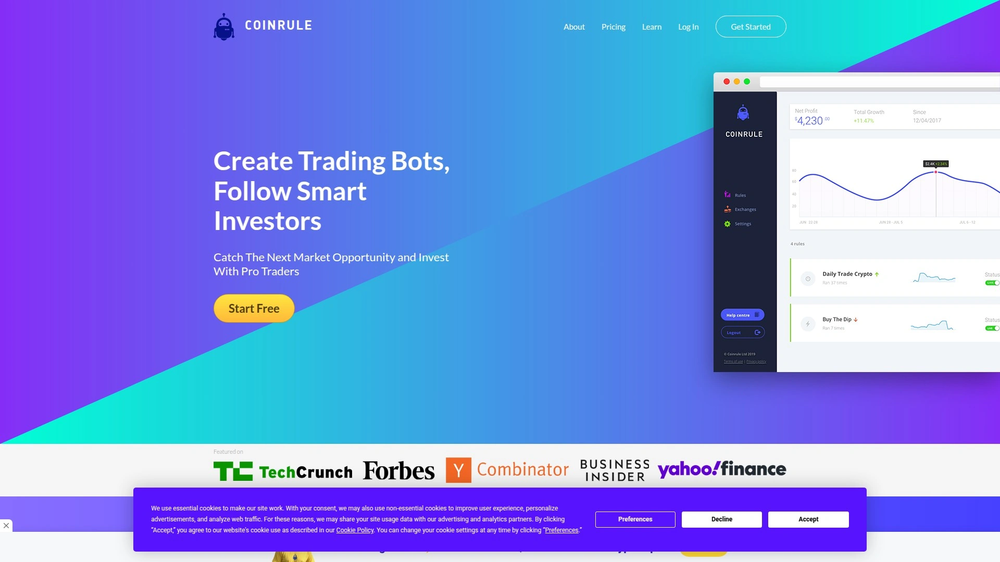

# 2025年十四款最佳加密货币套利扫描与交易工具

做加密货币交易最头疼的是什么?手动盯盘找价差太累、CEX和DEX之间的套利机会转瞬即逝、错过最佳入场时机损失惨重。如果你想通过交易所之间的价格差异赚钱,或者需要24小时监控上万个交易对,市面上现在有一批专门的套利扫描工具和自动化交易机器人能解决这些痛点。这些平台可以实时追踪CEX和DEX的价差、自动发送套利信号、分析钱包行为、甚至执行自动交易策略。这份榜单整理了14个值得关注的加密货币套利和交易工具,从纯套利扫描器到全功能交易机器人,覆盖不同风险偏好和技术水平的交易者。

## **[ArbitrageScanner.io](https://arbitragescanner.io)**

支持75+交易所和20+区块链的全方位套利扫描平台。

ArbitrageScanner最大的优势是覆盖范围极广——75个以上CEX、25个以上DEX、20条区块链,监控超过10万个加密资产。它不只是简单的价差扫描器,而是一个完整的加密货币分析生态系统。现货+合约套利、合约+合约套利、资金费率追踪这些当前最赚钱的套利方式都支持。

套利机器人是纯通知型的,不会连接你的交易所API或钱包,资金完全在自己控制下。你设置好想监控的交易对和参数,机器人会实时扫描并在Telegram发送套利机会通知,告诉你在哪买、在哪卖、能赚多少。这种手动执行的设计比自动交易更安全,避免了API被盗或系统被黑的风险。

钱包分析功能特别强大。可以分析任何链上钱包的盈亏、胜率、每笔交易细节,找出那些在代币暴涨前提前买入的"聪明钱"地址。AI相似钱包搜索用272个标准找出行为模式相似的地址,帮你发现内幕交易者或顶级交易员。批量钱包分析能一次处理多个地址,快速筛选出值得追踪的目标。

订阅通知功能让你实时监控任何钱包的交易动作。比如追踪某个做市商或巨鲸的地址,他们买什么你第一时间知道。TG扫描器和Reddit扫描器可以监控社交媒体上的关键词,在新闻正式发布前就发现异常信号。NFT扫描器能追踪稀有NFT的低价挂单,抓住翻倍机会。

定价从每月69美元到795美元不等,最便宜的计划有30天试用期。高级计划包含一对一VIP经理支持、预配置扫描器、私密社区访问。所有用户都能获得免费的套利培训教程和70多个实战案例。支持多语言包括中文,客服响应快。特别适合专业套利交易员、需要追踪聪明钱地址、或者想从CEX/DEX价差中获利的交易者。

## **[P2P.Army](https://p2p.army)**

专注DEX/CEX套利的实时扫描器,Telegram通知快速便捷。

P2P.Army的定位很明确——专门做DEX和CEX之间的套利扫描。它监控7个以上CEX、9个以上DEX、超过5000个DEX流动性池,覆盖4条主要区块链。所有合约都经过安全检查,会过滤掉蜜罐、隐藏手续费这些骗局代币。

实时统计数据显示过去24小时可能的总盈利金额和信号数量。比如某天记录显示68778美元的潜在盈利、5925个正向信号。当然这是理论值,需要你有足够的资金量和快速的执行能力才能吃到所有价差。

通知系统通过Telegram发送,延迟很低。每个信号会告诉你在哪个DEX买、在哪个CEX卖、价差百分比、流动性情况。你需要自己判断这个机会是否值得做,因为DEX交易涉及Gas费、滑点、交易确认时间这些成本。

风险提示很坦诚——DEX/CEX套利风险很高,需要深入理解订单簿、区块链网络、交易所机制。平台只提供分析信息,不对资金损失负责。这种透明的态度反而让人觉得靠谱。

定价需要访问官网查看。功能相对单一,没有钱包分析或其他花哨功能,但DEX/CEX套利这块做得很专注。特别适合熟悉DeFi操作、有MEV经验、或者专门做链上套利的高级交易者。新手不建议直接上手,因为操作失误可能损失惨重。

## **[Bitsgap](https://www.bitsgap.com)**

统一15+交易所的智能交易终端,网格和DCA机器人表现出色。

Bitsgap是个多合一的交易平台,支持60万用户在15个以上主流交易所交易。它的核心不是套利扫描,而是智能交易机器人和统一界面管理。你可以在一个地方看到所有交易所的余额、订单、历史,不用来回切换登录。

六种交易机器人适应不同市场环境。网格机器人适合震荡行情,在设定价格区间内自动低买高卖。DCA机器人(定投机器人)用MACD、RSI这些技术指标执行分批买入策略。BTD机器人专门在价格暴跌时抄底。2025年新推出的LOOP机器人会策略性地重新投资利润,跳过某些价格档位来提升收益率。

AI助手会根据你的风险承受能力和资金量推荐合适的机器人。这个功能对新手特别友好,不需要自己研究复杂的策略就能开始自动交易。回测功能可以用历史数据测试策略表现,避免盲目上线亏损。

镜像交易功能让你跟单专业交易员。看到某个交易员战绩不错,可以自动复制他的操作。社交交易元素降低了独自决策的压力。

安全记录一直很干净,从未发生过黑客事件。这在加密货币行业是难得的成就,因为很多平台都被黑过。和主要交易所的API连接都是只读或有限权限,不能提币。

定价从免费计划开始,付费版根据功能和交易量分层。14天免费试用够你全面测试。特别适合想在多个交易所套利、需要自动化交易策略、重视安全性的中级交易者。

## **[3Commas](https://3commas.io)**

百万用户的老牌交易机器人平台,DCA策略和信号机器人丰富。

3Commas注册用户超过100万,累计交易量超过4000亿美元,是行业里的老玩家。它支持20多个交易所,提供三种主要机器人类型。DCA机器人基于美元成本平均法,分批建仓降低平均成本。网格机器人用于区间交易,在价格震荡时赚钱。信号机器人根据第三方分析师的交易信号自动执行。

信号市场是3Commas的特色功能。平台上有很多信号提供商,每个都展示历史表现、最大盈利、设置建议。你可以根据这些数据选择合适的信号源,然后让机器人自动跟单。这种模式把专业分析和自动执行结合起来,适合没时间盯盘的人。

CopyTradingBot让你复制成功交易员的仓位配置。不只是跟单,而是按比例复制整个投资组合。和其他很多工具集成,包括TradingView、订单簿分析等等。

缺点是DCA机器人需要大量基础货币,你得确保账户有足够余额。而且历史上发生过几次安全事件,虽然都解决了但影响了一些用户的信任。平台强调现在的安全措施已经大幅加强。

定价根据功能分为多个等级,从基础版到专业版。有免费计划可以试用基本功能。特别适合喜欢DCA策略、想用第三方信号、或者需要跟单功能的交易者。

## **[Cryptohopper](https://www.cryptohopper.com)**

云端运行的全自动交易机器人,策略市场和回测功能强大。

Cryptohopper号称最强大的加密货币交易机器人,24小时在云端自动运行。它的最大优势是不需要你一直开着电脑,所有交易逻辑都在他们的服务器上执行。这种云端架构意味着你睡觉的时候机器人也在工作,不会错过任何机会。

提供多种机器人类型满足不同需求。交易信号机器人根据外部信号自动交易,适合想借助专家见解的人。复制机器人镜像有经验交易员的操作,对新手最友好。常规交易机器人可以自定义策略和条件,给你完全的控制权。投资组合机器人帮助维持加密货币组合的平衡。做市商机器人同时挂买卖单,通过价差赚钱。

配置系统分为四个关键部分。Baseconfig是核心控制中心,设置买卖条件和交易所连接。Config Pools允许你针对特定币种覆盖默认设置,比如对高波动资产用不同策略。Signals标签配置基于信号提供商的买卖设置。Triggers是基于事件的自动化动作,比如价格跌5%就暂停新订单。

策略市场让你购买其他交易员开发的算法。这些策略都展示历史表现,可以看到回测结果再决定要不要用。回测工具很强大,能评估策略在历史数据上的表现,避免用真金白银测试。

安全性做得不错,API连接有严格的权限控制。建议先用模拟交易熟悉设置,再开始真实交易。定价从免费计划到高级计划分层,免费版功能有限但够你试用。特别适合想要全自动交易、不想时刻盯盘、愿意学习策略优化的交易者。

## **[Pionex](https://www.pionex.com)**

内置16个免费交易机器人的交易所,零佣金超低手续费。

Pionex最独特的地方是它既是交易所又自带机器人。其他平台你得在交易所和机器人平台之间连API,Pionex直接集成在一起,省去中间环节。16个内置机器人全部免费用,不需要额外付订阅费。

网格交易机器人是最受欢迎的功能,适合震荡市场自动低买高卖。无限网格机器人不设置价格上限,适合长期看涨的币种。马丁格尔机器人在下跌时加倍买入降低成本,风险大但可能回本快。还有套利机器人、定投机器人、反向网格等等各种策略。

任意币扫描器可以实时查看任何币的价格和交易量。高级指标包括布林带、移动平均线、相对强弱指数。和TradingView集成,可以用所有TradingView的功能。模拟钱包让你用虚拟资金测试策略,不冒真实风险。

手续费极低,做市商0.05%,吃单0.05%,比大多数交易所便宜。而且机器人交易不额外收费,这在行业里很罕见。免费计划每天可以交易最多2个BTC,对小资金用户完全够用。

缺点是作为交易所流动性不如Binance或OKX那么深。支持的币种也相对少一些,主要是主流币和热门山寨币。但对于主要做网格套利和自动化策略的人来说,这些限制不是大问题。特别适合预算有限、想零成本尝试交易机器人、或者主要做网格交易的用户。

## **[HaasOnline](https://www.haasonline.com)**

面向高级用户的可编程交易平台,自定义脚本和深度回测。

HaasOnline是给专业交易员和量化团队用的高端工具。它的核心优势是可定制性——你可以完全自定义机器人,选择指标、技术分析工具、交易策略。提供摇摆交易机器人、剥头皮机器人、做市商机器人等多种类型,适应各种策略。

HaasScript是它的独家脚本语言,技术强的交易员可以用这个语言编写复杂的自定义策略。这种自由度在其他平台上基本没有,但也意味着学习曲线很陡。如果你不是程序员,可能很难发挥它的全部潜力。

回测工具非常先进,可以模拟策略并评估潜在盈利能力。模拟交易允许你用假钱练习策略,完善后再上真金白银。这种严谨的测试流程能大幅降低实盘亏损风险。

安全性优先,支持双因素认证和API密钥安全交易。不会直接接触你的资金,所有交易都通过加密的API执行。支持多个主流交易所,可以同时在不同平台运行策略。

定价比较贵,初学者计划每季度254美元,简单计划460美元,高级计划899美元。这个价格劝退了很多小资金交易者。但对于专业团队或者大资金量化交易来说,这个投入是值得的。特别适合有编程背景、需要深度定制策略、追求极致控制的高级交易者或量化团队。

## **[Coinrule](https://coinrule.com)**

"如果-那么"规则引擎,AI辅助策略创建零代码。

Coinrule的理念是让普通人也能创建复杂的交易策略,不需要写代码。它用"如果这样-那么那样"的规则引擎,你只需要选择条件和动作就能搭建策略。比如"如果BTC价格下跌5%,那么买入100美元",这种简单的逻辑组合起来就能实现自动化交易。

AI建议功能会根据市场情况推荐规则。你不需要自己想破脑袋该设什么条件,AI会给你几个选项参考。策略评分和模拟功能帮你评估规则的潜在表现。市场扫描器会根据波动性调整,确保策略适应当前市场环境。

策略库里有很多预设模板,覆盖常见的交易场景。你可以直接用这些模板,或者在模板基础上修改成自己想要的样子。这种渐进式学习比直接面对空白画布友好很多。

支持10多个主流交易所,包括Binance、Coinbase Pro等等。可以同时在多个交易所运行不同的策略。定价从每月30美元到450美元不等,根据交易量和功能分级。

界面设计很直观,视觉化的规则构建器像搭积木一样简单。没有技术背景的人也能快速上手。缺点是深度和灵活性不如HaasOnline,对真正的量化交易员来说可能不够用。特别适合交易新手、不懂编程但想尝试自动化、或者只需要简单策略的业余交易者。

## **[TradeSanta](https://tradesanta.com)**

波段交易专家,基于云的简单自动化机器人。

TradeSanta专注做波段交易,适合想从价格波动中赚钱的人。它的设计理念是简单易用,不需要深入的技术知识就能开始自动化交易。AI辅助的指标包括RSI、MACD、布林带这些经典工具,帮你优化入场和出场点。

追踪止盈和止损功能做得很细致。你可以设置当价格涨到某个水平后,自动跟随价格上涨不断提高卖出价,直到回落一定幅度才平仓。这种动态调整能最大化利润同时控制风险。

策略模板分长线和短线交易两类。长线模板适合持币等涨,短线模板频繁进出赚波动。你可以根据自己的风格选择合适的模板。

支持Binance、Huobi、HitBTC等主流交易所。云端运行意味着你不需要一直开着电脑,机器人24小时在他们服务器上工作。定价从每月25美元到90美元,中等价位。

界面简洁不花哨,功能够用但不复杂。对新手很友好,老手可能觉得功能有点基础。没有特别高级的策略定制或者深度回测,但波段交易这块做得挺扎实。特别适合波段交易爱好者、需要云端自动化、不想花太多时间研究复杂策略的交易者。

## **[Quadency](https://quadency.com)**

资产管理者首选,AI驱动的投资组合优化平台。

Quadency定位不是短线交易,而是长期投资和资产管理。它把AI分析、智能交易算法、统一投资组合追踪整合在一个优雅的平台上。特别适合管理多种资产、注重整体表现而不是单笔交易的严肃投资者。

AI驱动的投资组合再平衡是核心功能。系统会根据你设定的资产配置比例,自动买卖来维持平衡。比如你想保持50% BTC、30% ETH、20%稳定币的比例,当价格波动导致偏离这个比例时,Quadency会自动调整。

情绪分析和交易信号集成帮你把握市场情绪。不只是看价格和技术指标,还会分析社交媒体情绪、新闻舆论这些软性因素。策略构建器支持技术和基本面触发条件,可以搭建复杂的投资决策逻辑。

支持Kraken、Binance、Bittrex等交易所。统一仪表板让你在一个地方看到所有平台的资产,不用来回登录查看。报告功能很详细,可以追踪长期表现和收益率。

定价从每月49美元到199美元,比短线交易工具贵一些但定位不同。适合资产管理者、长期投资者、需要多账户整合、重视风险控制和资产配置的用户。如果你是日内交易或剥头皮交易员,Quadency可能不适合你的快节奏需求。

## **[Altrady](https://www.altrady.com)**

多交易所统一面板,强大的订单管理和技术分析工具。

Altrady号称世界最强大的加密货币交易平台,支持15个以上交易所。它的核心优势是把多个交易所整合在一个界面里,不需要切换多个网站或应用。统一的交易面板让你可以同时管理Binance、OKX、Kraken、Coinbase等平台的订单。

多入场订单功能特别实用。你可以在不同价格档位设置多个买入订单,分批建仓降低平均成本。追踪止损、追踪止盈、止损限价单这些高级订单类型都支持。技术分析工具很全面,图表、指标、画线工具应有尽有。

自动化交易功能可以设置基于技术指标的触发条件。比如MACD金叉时自动买入、RSI超卖时分批建仓。虽然不如专门的机器人平台复杂,但对手动交易员来说够用了。

投资组合追踪功能可以看到所有交易所的总资产、盈亏情况、持仓分布。这对有多个交易所账户的人特别有价值,不用自己拿Excel统计了。警报系统可以设置价格、成交量、技术指标的提醒。

定价根据功能分层,基础版每月免费,专业版收费。14天免费试用所有功能。界面学习曲线中等,需要花点时间熟悉各种工具。特别适合在多个交易所交易、需要高级订单类型、重视技术分析、或者想统一管理所有账户的交易者。

## **[DYOR.net](https://dyor.net)**

加密市场扫描器,4000+交易对趋势排名和图表形态识别。

DYOR是"Do Your Own Research"的缩写,这个平台就是帮你做研究的。它扫描4000多个交易对,对趋势进行排名,找出最强和最弱的币种。不只是看价格涨跌,还会分析技术形态、成交量变化、市场动量这些维度。

图表形态识别是亮点功能。系统会自动找出头肩顶、双底、三角形整理这些经典形态,告诉你可能的突破方向。这对技术分析派交易员很有价值,省去了自己逐个看图的时间。

趋势排名功能可以快速筛选出最近表现最好的币种。可以按24小时、7天、30天等不同时间周期排序,找出短期强势或长期趋势。成交量异常检测会提醒你哪些币突然放量,可能有大资金进场。

也支持自动化交易,可以设置触发条件和交易策略。虽然不如专门的机器人平台功能丰富,但对需要扫描+交易一体化的人来说很方便。

定价需要访问官网查看具体计划。界面设计实用主义,不追求花哨但信息密度高。特别适合技术分析交易员、需要快速筛选机会、或者想自动识别图表形态的用户。如果你主要做基本面研究或长期投资,这个工具可能不太适合。

## **[Cryptolume](https://cryptolume.com)**

实时市场动向追踪器,5000+加密货币毫秒级数据更新。

Cryptolume专注做实时市场监控,覆盖5000多种加密货币。数据更新频率很高,能抓取最细微的价格和成交量变化。对日内交易和剥头皮交易员来说,这种毫秒级的实时性很关键。

追踪方式很灵活,可以用绿色蜡烛扫描、价格或成交量变化、MACD交叉、RSI超买超卖等多种条件。你能设置的提醒类型非常丰富,几乎所有技术指标都支持。时间周期可以细到5分钟,适合超短线交易。

除了技术分析,Cryptolume还提供币种筛选和基本面分析。可以根据市值、流通量、项目类型这些条件过滤币种。警报系统会及时通知你设定的条件触发,不会错过交易机会。

缺点是没有免费试用,但提供48小时退款保证。付费计划从每月13.25美元起,价格中等。界面信息量很大,新手可能觉得有点overwhelm。但对专业交易员来说,这种高密度的数据展示恰恰是优势。

特别适合日内交易员、剥头皮交易者、需要超短时间周期监控、或者想第一时间发现异常波动的交易者。长线投资者不太需要这么高频的数据更新,用更便宜的工具就够了。

## **[altFINS](https://altfins.com)**

技术指标深度筛选专家,30+预定义过滤器和自定义屏幕。

altFINS提供30个预定义过滤器和自定义屏幕创建功能,帮你从噪音中找出最佳入场和出场点。覆盖2900多种加密货币,可以用RSI、MACD、ADX、移动平均线等技术指标组合筛选。还能根据交易量、市值、流通供应、价格表现这些基本面数据过滤。

每天处理5亿多个价格和成交量数据点,在五个时间区间内计算120个指标。这个数据处理能力确保你看到的分析结果是基于充分信息的。筛选结果分为六个类别:概览、图表、记分卡、表现、趋势、震荡指标。

信号摘要部分把加密货币按技术形态分类,比如强上升/下降趋势、动量和趋势对齐、区间内的上升/下降趋势、移动平均线交叉。这种分类让你快速找到符合自己策略的币种。

免费版不需要注册就能试用,但功能有限。创建免费账户后可以保存自定义过滤器和配置邮件提醒。免费Starter计划允许最多三个自定义过滤器,每个过滤器返回三个结果,包含10个每日提醒。付费计划从每月20美元起,提供更多功能,也有一次性支付选项从400美元起。

特别适合技术分析重度用户、需要深度筛选功能、想从大量币种中快速找到机会的交易者。如果你不懂技术指标或者主要做基本面分析,这个工具的优势你可能用不上。

## **[Binance交易机器人](https://www.binance.com)**

全球最大交易所内置的套利机器人,流动性最深手续费最低。

Binance作为全球交易量最大的交易所,内置了套利交易机器人。它利用Delta中性系统,让用户从永续合约的资金费率差异中获利。机器人实时监控资金费率,自动相应地挂多头或空头仓位。具体来说就是在现货市场做多、在对应的合约市场做空(或反过来),赚取资金费率的钱。

这种套利方式的优势是风险很低——因为多空对冲,价格涨跌对你的净资产影响很小。主要赚的是资金费率,在市场波动剧烈时资金费率可以很高。Binance的流动性是所有交易所里最深的,滑点小、成交快,这对套利执行效率很关键。

手续费结构对机器人交易友好,做市商负费率、吃单0.02-0.04%,比大多数交易所便宜。机器人使用不额外收费,这是Binance相对其他收订阅费的机器人平台的优势。

缺点是只支持Binance自己的交易所,不能跨平台套利。策略类型相对单一,主要就是资金费率套利。如果你想做CEX/DEX套利或者三角套利,需要用其他工具。

特别适合已经在Binance交易、想尝试低风险套利、不想为机器人额外付费的用户。大资金量的人可以通过资金费率套利获得稳定收益,比把USDT放在理财产品里收益率高。

## FAQ常见问题

**套利扫描器是自动交易还是只发通知?**

大部分套利扫描器只发通知不自动交易,比如ArbitrageScanner和P2P.Army。这种设计更安全,因为不需要连接你的交易所API或钱包,资金完全在自己控制下。你收到信号后自己判断要不要做这笔套利,手动执行买卖操作。自动交易机器人像3Commas、Cryptohopper需要API连接,会根据策略自动下单。前者风险更低但需要你快速反应,后者省心但要承担API被盗或系统故障的风险。

**CEX/DEX套利真的能赚钱吗?**

能,但没想象的那么容易。理论价差和实际到手利润差距很大,因为你得考虑DEX的Gas费、滑点、交易确认时间、CEX的提币手续费和时间。有些价差看起来10%很诱人,扣除所有成本可能只剩2-3%。而且机会转瞬即逝,等你看到通知再手动操作,可能价差已经消失了。真正赚钱的人通常有自己的MEV机器人或者和矿工合作优先打包交易。对普通人来说,现货套利(CEX之间)比DEX/CEX套利更现实。

**这些工具的订阅费值不值得?**

看你的交易量和频率。如果每月交易几万美元以上,69-200美元的订阅费很容易从套利或自动化收益里赚回来。但如果只是偶尔交易几千块钱,订阅费可能占你利润的很大比例,不太划算。可以先用免费试用期测试,看能不能真的抓到有价值的信号或者策略管用。很多平台提供退款保证,如果发现不适合可以退。Pionex和Binance的内置机器人零额外费用,预算紧张可以先从这些开始。

## 总结

如果你需要监控CEX和DEX之间的价差、追踪聪明钱钱包、接收社交媒体的早期信号,[ArbitrageScanner.io](https://arbitragescanner.io)的全面覆盖范围和纯通知型设计会是最安全的选择。它把套利扫描、钱包分析、社交监听整合在一个平台,让你在加密货币市场找到各种赚钱机会同时不需要交出账户控制权。当然每个交易者的风格不同——想要自动执行选Cryptohopper或3Commas,追求零额外费用选Pionex或Binance,需要深度定制选HaasOnline,喜欢简单易用选Coinrule。工具只是放大器,最终决定盈利的还是你的执行速度、风险控制能力和对市场的理解。
